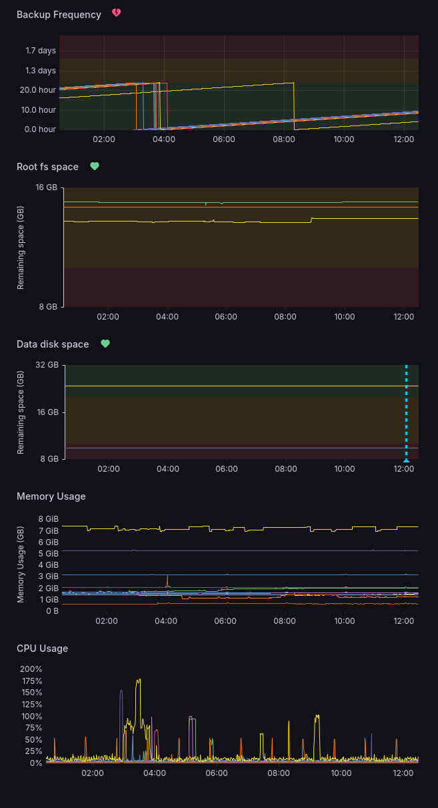

# *datalab* Grafana

Ansible playbook that deploys the monitoring stack for the federated [*datalab*](https://datalab-org.io) instances that are part of the [*datalab-org* federation](https://github.com/datalab-org/datalab-federation).

Stack components include:

- Prometheus,
- Grafana (with provisioned dashboards, datasources and alert rules),
- nginx + Let's Encrypt,
- fail2ban.

all on a single Ubuntu 22.04/24.04 host running Docker.

The monitoring itself (node-exporter, borgmatic-exporter, scrape config) is set up on the federated instances by [datalab-industries/datalab-ansible-terraform](https://github.com/datalab-industries/datalab-ansible-terraform); this repo only covers the central host that aggregates and visualises the metrics.

Built and maintained by [datalab industries](https://datalab.industries).

Shared in the spirit of "useful reference" rather than reuse — the inventory, secrets, and dashboards are tailored to our deployment. You're welcome to crib from it.

## What it observes

The default dashboard surfaces a per-instance view of:

- **Backup frequency** — time since the last successful borgmatic run.
- **Root and data filesystem usage** — free space on `/` and `/data`.
- **Memory and CPU usage** — basic node-exporter metrics.

The provisioned alert rules (routed to PagerDuty) cover:

- **Backups** — fires if the last archive shrank by >1% relative to the previous day (corruption / truncation canary).
- **BackupsOverdue** — fires if no successful backup has been seen for >36 hours.
- **Root fs space** — fires when `/` drops below 10% free.
- **Data disk space** — fires when `/data` drops below 5 GB free.
